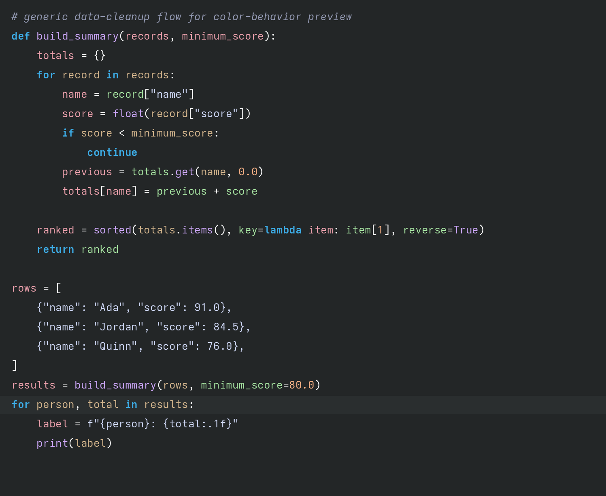

# konsole-breeze-ansi

Breeze-inspired Neovim colorscheme with a dark, negative-space style where color feels revealed from under the background.

## Screenshot



## Highlighting Algorithm

The theme uses a layered pipeline so the same model can work across languages:

1. Base Vim highlight groups from `colors/konsole_breeze_ansi.vim`.
2. Semantic mapping in `lua/konsole_breeze_ansi/semantic.lua` for both Treesitter and LSP token groups.
3. Priority policy in `lua/konsole_breeze_ansi/init.lua`:
   - `semantic_tokens = 130`
   - `treesitter = 120`
   - `syntax = 100`
4. Contextual overlays in `lua/konsole_breeze_ansi/contextual.lua` using Treesitter extmarks as fallback/refinement.

This means: LSP semantic tokens classify first when available, then Treesitter and contextual passes fill gaps.

## Contextual Rules (Cross-Language)

- Variables on assignment/declaration definition targets (left side/write side) are rose, except loop-header variables.
- Variables used as reads are yellow-green.
- Variables in loop headers, conditional tests, and call argument positions are light brown.
- Variables inside string/template/interpolation scopes use yellow-green.
- Functions and methods are lavender.
- Class/type/interface/enum/struct definitions are forced to lavender.
- Type-cast syntax and primitive cast calls (`int(...)`, `float(...)`, `str(...)`, etc.) are deep purple.
- Import/include keywords are blue; import target/module identifiers are yellow-green.
- Delimiters (`.`, `,`, `:`, quotes, etc.) are true white or blue (string delimiters).
- Bracket family uses Breeze green/teal with depth accents:
  - nested depth 2: yellow-green
  - depth 3+: breeze blue (bold)
  - brackets inside strings: string color

## Core Palette

- Background: `#232627`
- Foreground text: `#CDD6F4`
- Variables (write-side): `#EBA0AC`
- Variable reads: `#A6E3A1`
- Dynamic/conditional reads: `#D2B48C`
- Functions/methods/types: `#CBA6F7`
- Type-cast accents: `#6B3FA0`
- Keywords: `#3DAEE9`
- Brackets (base family): `#1ABC9C`
- Delimiters (true white): `#FFFFFF`
- Numbers: `#FAB387`

## ANSI Palette (0-15)

- `#232627`
- `#EBA0AC`
- `#A6E3A1`
- `#FAB387`
- `#3DAEE9`
- `#CBA6F7`
- `#1ABC9C`
- `#CDD6F4`
- `#7F8C8D`
- `#EBA0AC`
- `#A6E3A1`
- `#FAB387`
- `#EBA0AC`
- `#CBA6F7`
- `#16A085`
- `#CDD6F4`

## lazy.nvim

```lua
{
  "pythoncarpenter/konsole-breeze-ansi",
  lazy = false,
  priority = 1000,
  config = function()
    require("konsole_breeze_ansi").setup({
      semantic = true,
      transparent = false,
    })
  end,
}
```
